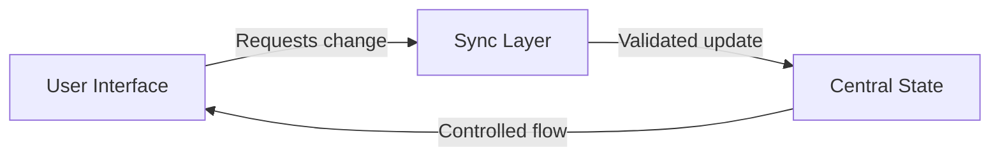
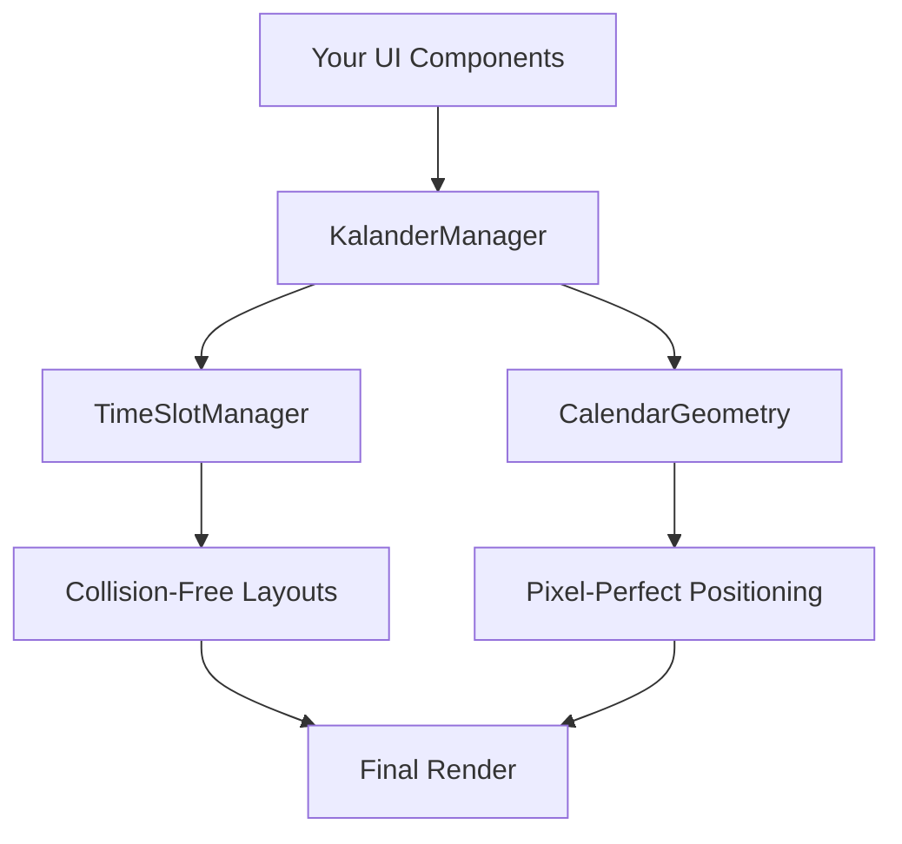
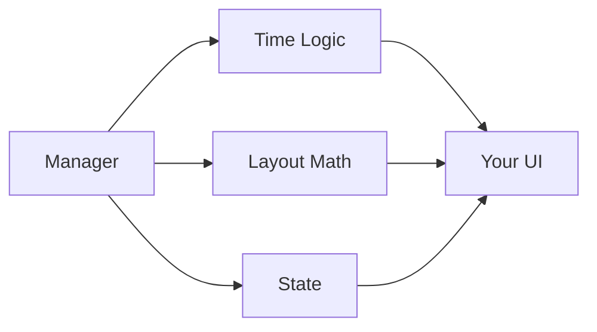

# 🚀 Kalander – The Svelte Calendar Architecture You've Been Waiting For  

> **Finally:** A battle-tested architecture for complex calendar UIs that won't collapse under its own weight  

**Kalander** (pronounced *Kal-Lander*) solves what every seasoned developer dreads: building maintainable calendar systems that actually scale. Forget monolithic components and scattered date logic - this is the architectural foundation serious teams use to ship scheduling UIs that last.  
!(Calander Image)[https://raw.githubusercontent.com/DruPro/Kalander/refs/heads/main/docs/Screenshot%202025-07-26%20173922.png]


## 🧠 The Philosophy That Changes Everything  

### ⚡️ No More God Components  
**Stop the madness:** Kalander surgically separates concerns so your calendar logic doesn't turn into unmaintainable spaghetti. Like a master city planner, we enforce:  
- **Specialized modules** with laser-focused responsibilities  
- **Explicit contracts** between components (USB-C style interfaces)  
- **Architectural guardrails** that prevent logic entanglement  

### 🔒 Intelligent Encapsulation  
We follow the **5-Function Rule™**:  
```  
When internal logic grows beyond ~5 functions → Time to encapsulate  
```  
This creates self-contained units with meaningful behavior - not premature micro-components.  

### 🌉 Controlled Data Flow  
**Two-way binding? Only with airlocks:**  

No more free-for-all data mutations - just predictable, debuggable state management.  

---

## ⚙️ The Nuclear Triad: Core Architecture  

| Module             | Responsibility                          | Why It Matters                  |  
|--------------------|-----------------------------------------|---------------------------------|  
| `KalanderManager`  | Central orchestration                   | Single source of truth for state|  
| `TimeSlotManager`  | Event collision & time logic            | Handles 10k+ appointments cleanly |  
| `CalendarGeometry` | Time-to-pixel mapping                   | Perfect rendering at any zoom   |  

**The magic happens when they work together:**  


---

## 🛠️ How Serious Teams Implement Kalander  

### Folder Structure That Scales  
```  
src/  
├── components/  
│   ├── calendar/  
│   │   ├── managers/    # KalanderManager lives here  
│   │   ├── views/       # Dumb visual components  
│   │   ├── modals/      # Contained popup logic  
│   │   └── utils/       # Time formatting helpers  
├── modules/  
│   └── useTemporal.js   # Reusable Temporal logic  
```  

### Component Integration Made Simple  
```svelte  
<script>  
  // 1. Initialize core manager  
  import KalanderManager from './managers/KalanderManager.svelte';  
  const kalander = KalanderManager();  
  
  // 2. Feed raw appointments  
  let appointments = $state.raw([...]);  
</script>  

<!-- 3. Connect to UI components -->  
<CalendarView {kalander} {appointments} />  
<DatePicker bind:date={kalander.context.selectedDate} />  
```  

---

## 💥 Why This Beats Typical Implementations  

### Before Kalander  
```javascript  
// Nightmare in component-land  
export default class GodCalendar extends MegaComponent {  
  handleTimezones() { /* ... */ }  
  calculateOverlaps() { /* ... */ }  
  renderGrid() { /* ... */ }  
  manageState() { /* ... */ }  
  // ... 1200 more lines  
}  
```  

### With Kalander  

**Each concern lives in its proper home**  

---

## 🌟 Benefits You'll Experience  

1. **Zero Date Logic in UI Components**  
   - Your views stay pure and testable  

2. **Timezone Changes Handled Centrally**  
   - No more hunting for `new Date()` across 20 files  

3. **Collision Detection That Scales**  
   - Add 10x more appointments without refactoring  

4. **Consistent Cross-Component Updates**  
   - Toolbar ↔ Week view ↔ Day view just work  

5. **New View Types in Hours, Not Days**  
   - Add month/week/day views using same core  

---

## 🏗️ Built for These Real-World Scenarios  

- **Hospital OR Schedulers** with life-critical timing  
- **Financial Trading Floors** handling market hours  
- **Global Team Planners** spanning 12 timezones  
- **Industrial Maintenance Calendars** with 10k+ events  

---

## 🚀 Getting Started  

1. **Adopt the mental model** (managers vs views vs utils)  
2. **Isolate your date logic** into TimeSlotManager  
3. **Separate layout math** into CalendarGeometry  
4. **Connect via KalanderManager** as central hub  

> "We reduced calendar-related bugs by 80% after switching to this architecture"  
> – Lead Engineer, Healthcare SaaS Platform  

---

## 🔮 The Future Is Maintainable  

```diff  
# Your calendar system in 6 months  
+ Confidently add new features  
+ Onboard developers faster  
+ Sleep through DST transitions  
- No more "calendar emergency" sprints  
```  

**Kalander isn't a library - it's architectural wisdom distilled.**  

[Explore the Code] • [View Sample Implementation] • [Contribute]
