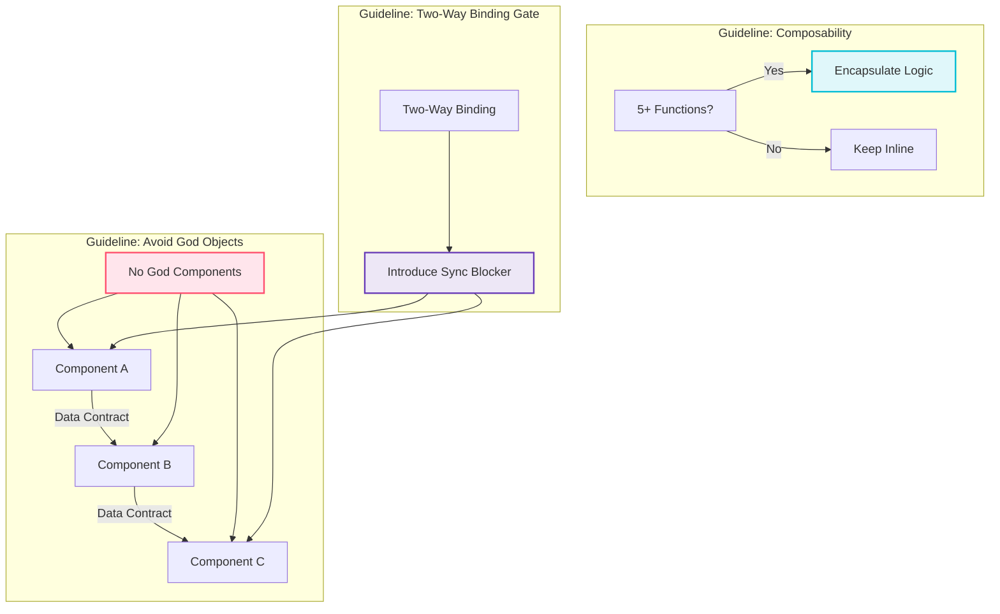

# Kalander - Architectural Design Philosophy

Welcome to the Kalander component system. This document outlines the core architectural values and heuristics that govern how we structure, design, and reason about components.

---

## 🧠 Core Philosophy

We believe in **maintainability through meaningful separation of concerns**. Our components are not only functional—they are *coherent*, *decoupled*, and *speak the same dialect*. Think of it as building a smart city with roads, contracts, and modular infrastructure—not a spaghetti bowl.

---

## 📜 Guiding Principles

### 1. No God Components

**Avoid massive all-knowing components that do everything.**

* Instead: Divide responsibilities logically across smaller units.
* Analogy: A conductor does not play every instrument.

### 2. Decentralized Mutual Contracts

**Components can rely on each other's state, but only via clear contracts.**

* Data and events must flow through explicit interfaces.
* Think like USB-C: standardized ports, not hardcoded wires.

### 3. Heuristic for Encapsulation

**If internal logic requires \~5 or more functions, encapsulate it.**

* This implies a self-contained lifecycle or meaningful local behavior.
* Don’t build micro components for every one-liner; balance reuse with meaning.

### 4. Controlled Two-Way Binding

**Use binding only when necessary, and always behind a gatekeeper.**

* Introduce a sync layer or mediator to prevent unpredictable data flow.
* Treat bidirectional data like water through a canal lock.

---

## 🗺️ Component Interaction Diagram



---

## 🌱 Growing with Intention

This architecture is a living design. Simplicity wins, but not at the cost of clarity. Encapsulate when there's gravity. Compose when there's synergy. Bind when there's trust.

> "The architecture should not just work—it should make you feel like it wants to be extended."

---

## ✨ Naming Convention

* Modules: `useXYZ` for shared logic.
* Managers: Handle domain rules & interactions.
* Controllers: Handle modal or temporal flows.
* Views: Purely visual renderers, dumb by design.

---

## 📦 Folder Structure

```
src/
├── components/
│   ├── admin/
│   │   ├── calendar/
│   │   │   ├── views/
│   │   │   ├── modals/
│   │   │   └── managers/
├── modules/
│   └── useModalController.js
├── utils/
│   └── timeHelpers.js
```

---

## 🧪 Future Ideas

* Add domain boundary visualizers
* Runtime warnings for anti-patterns (e.g. oversized component bodies)
* Svelte devtools layer with rule inspection

---

## 👁️‍🗨️ Inspiration

* Domain-Driven Design
* React Hooks & Provider Patterns
* Clean Architecture
* Design Systems Thinking

---

Let Kalander be a joy to build, maintain, and scale. 🛠️
